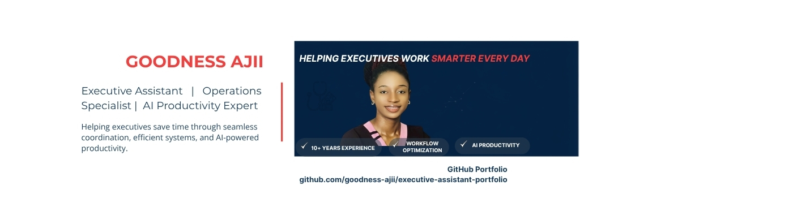
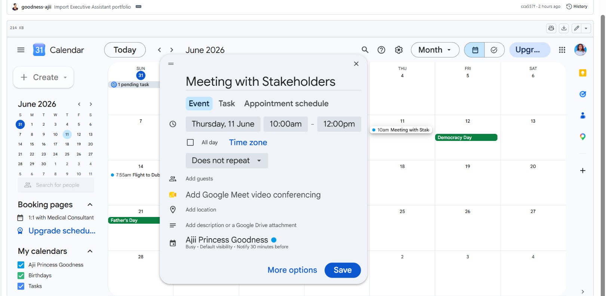
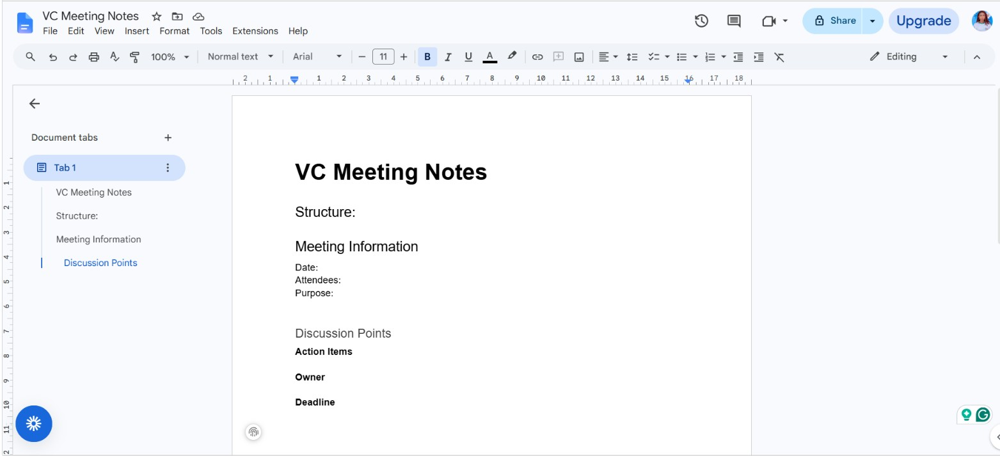
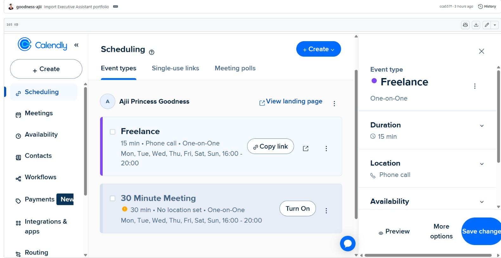
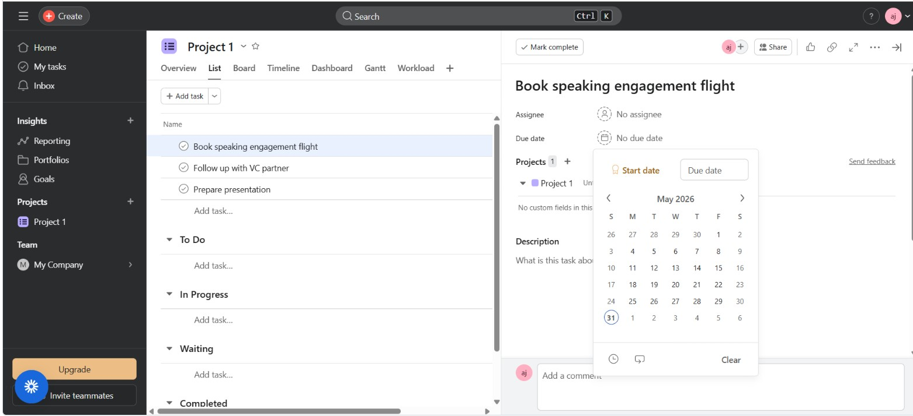
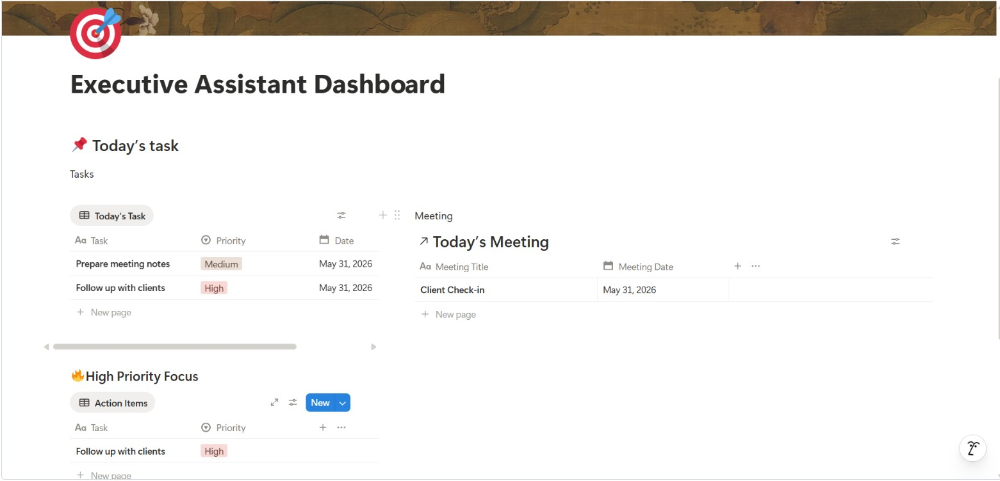

<p align="center">

</p>

# 👋 Welcome!

I'm **Goodness Ajii Eneogbu**.

### Executive Assistant | Operations Specialist | AI Productivity Expert

Helping executives save time through seamless coordination, efficient systems, and AI-powered productivity.

---

# About Me

I am an Executive Assistant and Executive Virtual Assistant with over **10 years of professional experience** supporting complex operations, coordinating executive priorities, and improving workflows.

My background combines executive support, administrative operations, project coordination, documentation, scheduling, travel planning, and AI-powered workflow optimization.

I build systems that help executives focus on strategic priorities while ensuring day-to-day operations run smoothly.

---
# Career Snapshot

With more than **10 years of professional experience**, I have supported fast-paced operations by coordinating schedules, managing documentation, improving workflows, and ensuring executives can focus on high-value strategic work.

My experience spans healthcare operations, executive support, virtual assistance, workflow optimization, and AI-assisted productivity.

Today, I combine executive administration with modern technology to build efficient systems that reduce manual work and improve operational excellence.

# Core Expertise

- Executive Support
- Calendar Management
- Inbox Management
- Executive Correspondence
- Meeting Coordination
- Travel Planning
- Project Coordination
- Workflow Optimization
- SOP Development
- AI Productivity
- Executive Reporting
- Stakeholder Communication

---

# Technology Stack

| Productivity | Project Management | AI & Automation |
|--------------|--------------------|-----------------|
| Google Workspace | Asana | ChatGPT |
| Microsoft 365 | Notion | Claude AI |
| Google Calendar | Airtable | Zapier |
| Outlook | Trello | Make |
| Calendly | Slack | n8n |
| Zoom | TripIt | Canva |

---
# Featured Portfolio Projects

## 📅 Executive Calendar Management



Managed executive calendars using Google Calendar while prioritizing meetings, reducing scheduling conflicts, and improving executive productivity.

**Skills Demonstrated**

- Calendar Management
- Time Blocking
- Executive Scheduling
- Prioritization

➡️ View the complete project inside the **02 Calendar Management** folder.

---
# Impact Highlights

Throughout my career, I have delivered measurable operational improvements, including:

✔ Reduced scheduling conflicts by **50%** through structured calendar management.

✔ Improved workflow efficiency by **60%** by implementing standardized administrative systems.

✔ Reduced repetitive administrative work by **40%** using AI-assisted productivity tools.

✔ Coordinated **200+ monthly stakeholder interactions** with professionalism and accuracy.

✔ Managed confidential documentation while maintaining strict compliance and organizational standards.

✔ Designed reusable SOPs that improved consistency across recurring administrative tasks.

# Professional Toolkit

### Productivity

- Google Workspace
- Microsoft 365
- Outlook
- Google Calendar
- Google Docs
- Google Sheets

### Executive Support

- Calendar Management
- Meeting Coordination
- Travel Planning
- Inbox Management
- Executive Briefings

### Project Management

- Notion
- Asana
- Airtable
- Trello
- ClickUp

### Communication

- Slack
- Zoom
- Google Meet
- Microsoft Teams

### AI Productivity

- ChatGPT
- Claude AI
- Zapier
- Make
- n8n

# Currently Learning

I continuously improve my executive support and automation skills through practical projects involving:

- AI Productivity Systems
- Executive Workflow Automation
- Advanced Notion Workspaces
- Airtable Databases
- Executive Operations
- Business Process Optimization

# Certifications

✔ Certified Medical Virtual Assistant

✔ AI Automation Practitioner

✔ Licensed Registered Nurse (RN)

✔ Nephrology Nursing Experience (10+ Years)

## 📝 Executive Meeting Notes



Prepared professional meeting agendas, meeting minutes, and action trackers that improve accountability and follow-through.

**Skills Demonstrated**

- Documentation
- Meeting Coordination
- Executive Communication
- Action Tracking

➡️ View the complete project inside the **01 Meeting Notes Management** folder.

---

## ✈️ Executive Travel Planning


Created executive travel itineraries using Google Flights and TripIt while coordinating schedules and logistics.

**Skills Demonstrated**

- Travel Coordination
- Logistics
- Executive Planning
- Attention to Detail

➡️ View the complete project inside the **03 Flight Search** folder.

---

## 📆 Meeting Scheduling



Configured Calendly scheduling pages to simplify meeting booking while reducing administrative workload.

**Skills Demonstrated**

- Scheduling
- Client Communication
- Calendar Optimization

➡️ View the complete project inside the **04 Meeting Scheduling** folder.

---

## ✅ Executive Task Management



Managed executive projects and tracked deliverables using Asana.

**Skills Demonstrated**

- Project Coordination
- Task Management
- Deadline Tracking

➡️ View the complete project inside the **05 Action Item Tracking** folder.

---

## 📚 Conference Planning



Built a centralized conference planning workspace using Notion to organize tasks, schedules, and documentation.

**Skills Demonstrated**

- Knowledge Management
- Documentation
- Project Planning

➡️ View the complete project inside the **07 Conference Management** folder.

---

## 📊 Executive Weekly Briefings


Produced concise executive reports summarizing priorities, risks, deadlines, and operational updates.

**Skills Demonstrated**

- Executive Reporting
- Communication
- Strategic Support

---

# Portfolio Structure

```
01 Meeting Notes Management

02 Calendar Management

03 Flight Search

04 Meeting Scheduling

05 Action Item Tracking

06 TripIt

07 Conference Management

Executive Meeting Notes Sample

Conference Travel Itinerary Sample

Weekly Executive Briefing Sample
```

---

# Resume

Download my Executive Assistant Resume

📄 Goodness_Ajii_Executive_Assistant_Resume.pdf

# Why Work With Me?

I help executives and leadership teams:

✅ Stay organized

✅ Improve productivity

✅ Save time

✅ Streamline operations

✅ Build efficient systems

✅ Reduce administrative workload

---

# Available for Opportunities

I am currently open to:

✔ Executive Assistant

✔ Executive Virtual Assistant

✔ Operations Coordinator

✔ Administrative Coordinator

✔ Chief of Staff Support

✔ Remote Executive Support

✔ Operations Specialist

Remote • Hybrid • International Opportunities

# Connect With Me

📧 Email

hello@goodnessajii.com

🌐 Website

https://goodnessajii.com

💼 LinkedIn

https://linkedin.com/in/goodness-ajii

🐙 GitHub

https://github.com/goodness-ajii

---

---

Thank you for visiting my portfolio.

I enjoy creating organized systems that help executives save time, improve productivity, and operate more efficiently.

Let's connect.

⭐ If you found this portfolio helpful, feel free to connect with me on LinkedIn.
